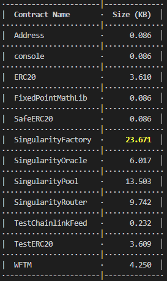
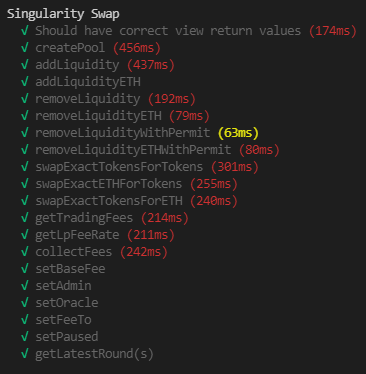
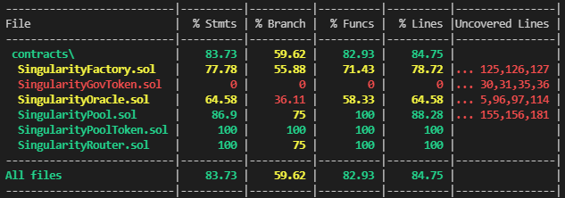
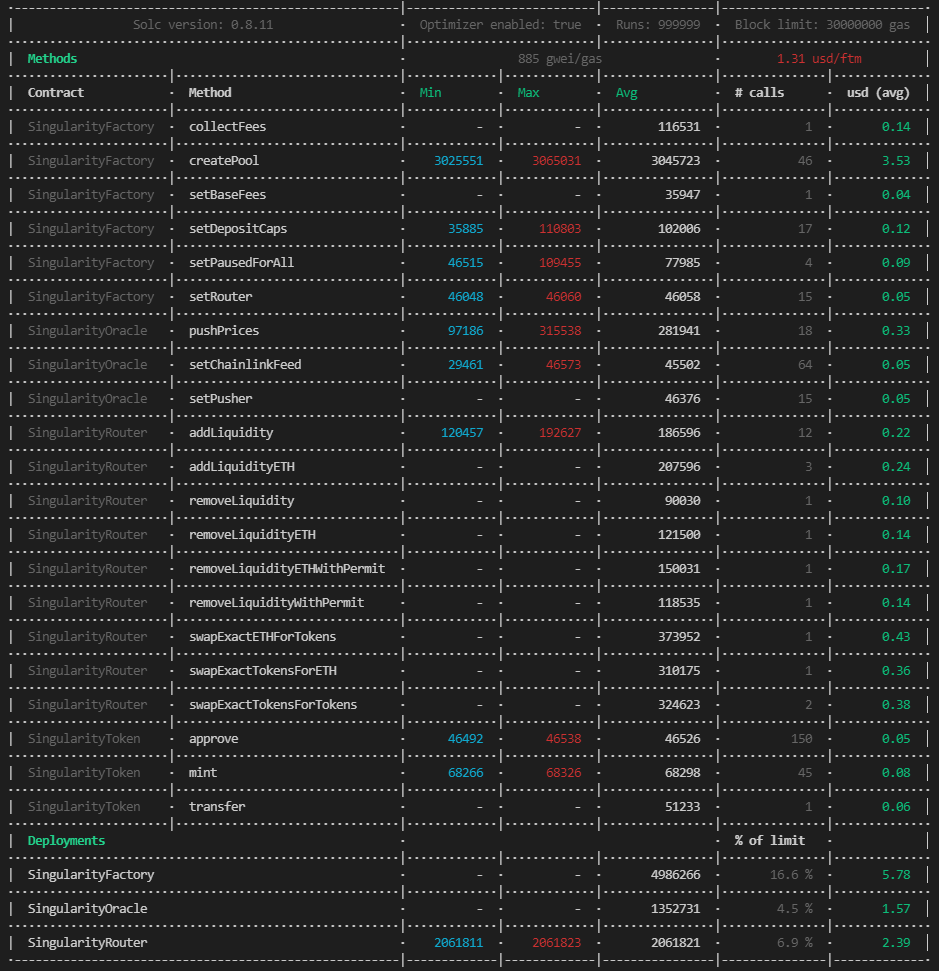

# Deployed Contract Addresses

## Mainnet Deployments

### Protocol Contracts
| Name | Address |
| :--- | :--- |
| SingularityOracle | [0xf8b88f0d5bd0669a7a59e1812ebf1bdf93948b7a](https://ftmscan.com/address/0xf8b88f0d5bd0669a7a59e1812ebf1bdf93948b7a#code) |
| SingularityFactory | [0x973d23d8f60a05ed4746c443d89e97755501616f](https://ftmscan.com/address/0x973d23d8f60a05ed4746c443d89e97755501616f#code) |
| SingularityRouter | [0xdc677509fe9b779726fd470df0ac9a44bb6d1e14](https://ftmscan.com/address/0xdc677509fe9b779726fd470df0ac9a44bb6d1e14#code) |

### Fantom Contracts and Pools
| Name | Address |
| :--- | :--- |
| USDC Pool | [0xFE0026214A92b531bbb3971359910e5B82813447](https://ftmscan.com/address/0xFE0026214A92b531bbb3971359910e5B82813447#code) |
| fUSDT Pool | [0x9C1B8818B336eBc616b29604d12Cd626817e43a7](https://ftmscan.com/address/0x9C1B8818B336eBc616b29604d12Cd626817e43a7#code) |
| DAI Pool | [0x4f2985Cb8f97C5763D1c6539C8bBD59c6D058250](https://ftmscan.com/address/0x4f2985Cb8f97C5763D1c6539C8bBD59c6D058250#code) |

## Outputs
#### Contract Sizes

#### Unit Tests

#### Code Coverage

#### Gas Report
